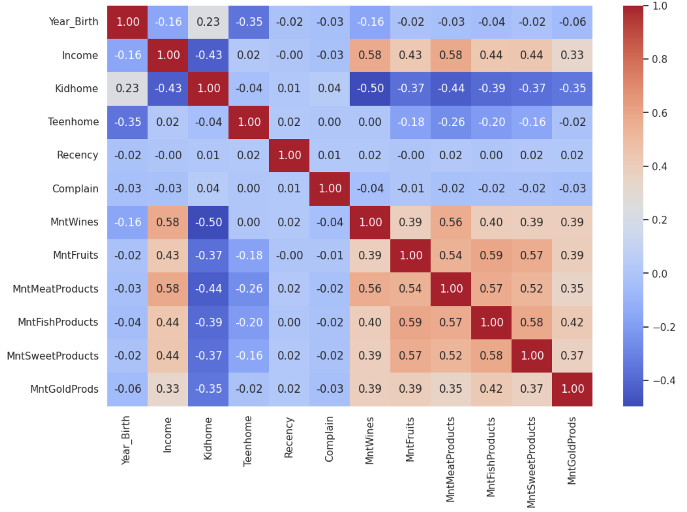
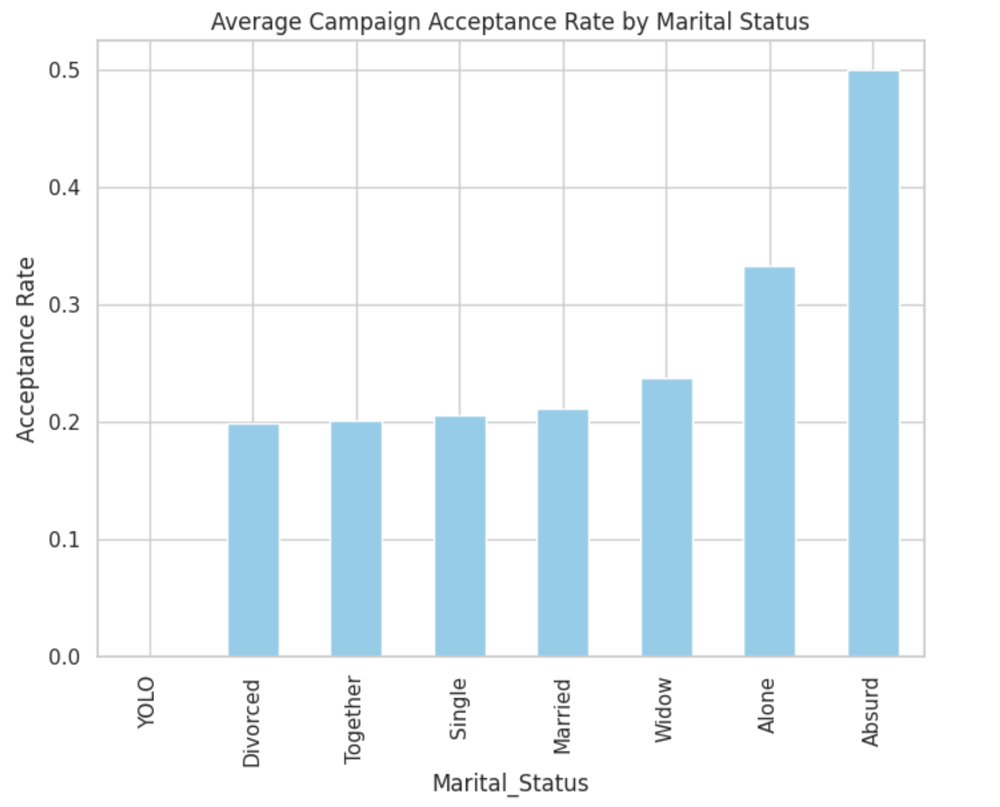

# 📊 Amazon Sales and Customer Personality Analysis

Mahla Entezari  
Shahid Beheshti University  
📧 MahlaEntezari.sbu@gmail.com  

---

## 🧠 Abstract

This project explores Amazon's sales data and customer personality metrics using data science techniques. The objective is to derive actionable insights to inform marketing strategies, inventory planning, and revenue optimization. The analysis combines sales trends with demographic and behavioral insights of customers to provide a comprehensive business intelligence view.

---

## 📂 Dataset Overview

### 1. **Amazon Sales Dataset**
Sourced from Kaggle, this dataset includes:
- Product prices
- Discounts
- Ratings
- Reviews
- Sales volumes

### 2. **Customer Personality Dataset**
Also from Kaggle, this dataset includes:
- Demographics (age, education, marital status)
- Financial details (income)
- Lifestyle metrics (number of children, recency)
- Marketing campaign responses

📌 **Sources**:
- [Amazon Sales Dataset](https://www.kaggle.com/datasets/mahlaentezari/amazon-dataset)
- [Customer Personality Dataset](https://www.kaggle.com/datasets/imakash3011/customer-personality-analysis/data)

---

## 🛠️ Methods

### 🔍 Data Preprocessing
- Handled missing values and duplicates
- Normalized formats
- Feature engineering: Aggregated sales per month, income brackets, etc.

### 📈 Exploratory Data Analysis
Used pandas, seaborn, and matplotlib to:
- Understand distributions
- Reveal customer behavior patterns
- Identify seasonality and trends

### 📊 Statistical Testing
- **Shapiro-Wilk** and **Kolmogorov-Smirnov** tests confirmed non-normality of the data.
- These tests justified the use of non-parametric methods in follow-up analysis.

---

## 📊 Visualizations & Key Insights

### 1. Correlation Matrix


**Insight:**  
- Income is positively correlated with spending on wines, meats, and other products.
- Households with more children (Kidhome) tend to spend less.
- Variables like `Recency` and `Complain` show minimal correlation with spending behavior.

### 2. Average Campaign Acceptance Rate by Marital Status


**Insight:**  
- Married and “Together” individuals respond more to marketing campaigns.
- Categories like “Alone” and “Absurd” display unusually high acceptance rates, suggesting potential data quality issues.

### 3. Average Income by Education Level


**Insight:**  
- PhD holders earn the highest on average, followed by Master and Graduation levels.
- Individuals with Basic or 2n Cycle education earn significantly less.
- Clear economic advantage tied to advanced degrees.

### 4. Campaign Acceptance by Education Level


**Insight:**  
- Higher education levels (PhD, Master) correspond to greater campaign engagement.
- Lower education groups show reduced responsiveness, possibly requiring different campaign strategies.

### 5. Distribution of Age


**Insight:**  
- Most customers fall within the 40–60 age range.
- Distribution is slightly skewed right; few customers are older than 80 or younger than 30.

### 6. Distribution of Customer Education Level


**Insight:**  
- The largest group has a Graduation-level education.
- There are significantly fewer customers with Basic or 2n Cycle education.

### 7. Spending Behavior by Marketing Campaign Participation


**Insight:**  
- Customers who accepted marketing campaigns spend significantly more.
- Highlights the effectiveness of targeted promotions and campaigns.

---

## 📚 References

1. Amazon Sales Dataset - [Kaggle](https://www.kaggle.com/datasets/mahlaentezari/amazon-dataset)
2. Customer Personality Dataset - [Kaggle](https://www.kaggle.com/datasets/imakash3011/customer-personality-analysis/data)
3. Visualization Resource - [From Data to Viz](https://www.data-to-viz.com/)
4. Cole Nussbaumer Knaflic, *Storytelling with Data*

---

## 💻 How to Run

1. Clone this repository.
2. Install dependencies:
   ```bash
   pip install pandas matplotlib seaborn scipy jupyter
   ```
3. Launch the notebook:
   ```bash
   jupyter notebook Mahla_Entezari-Assignment-1.ipynb
   ```
